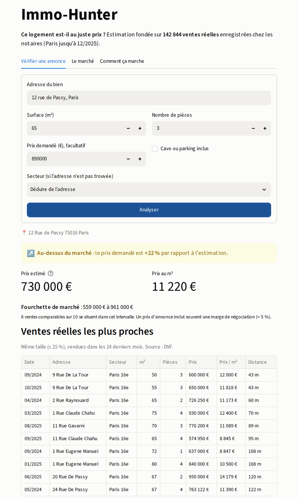
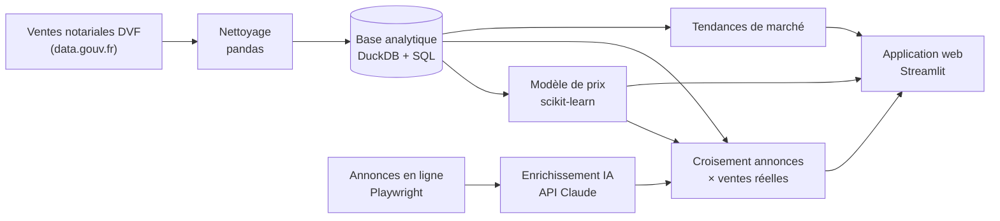
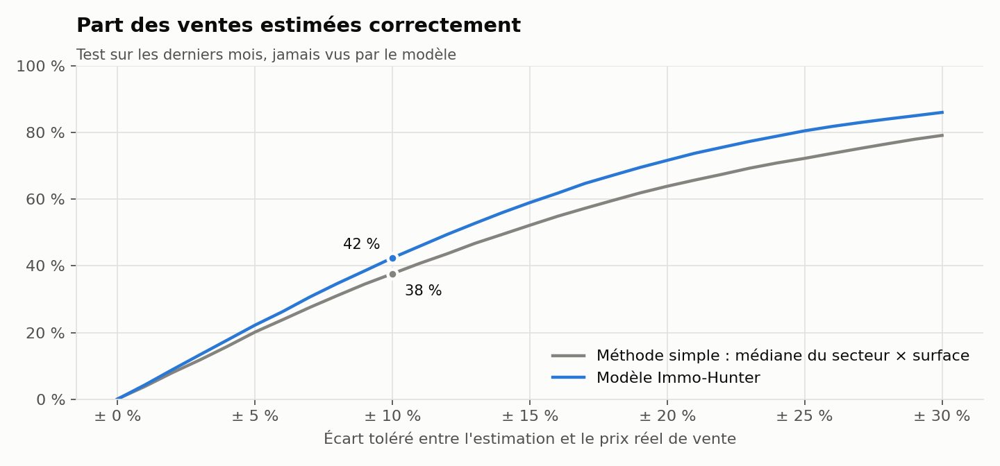
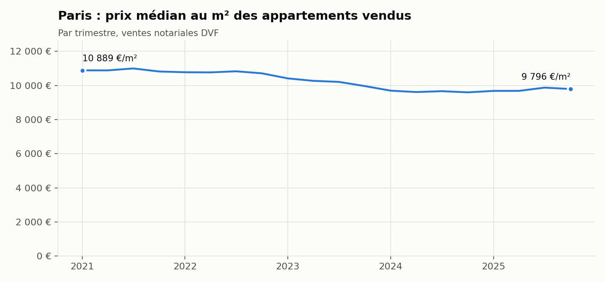
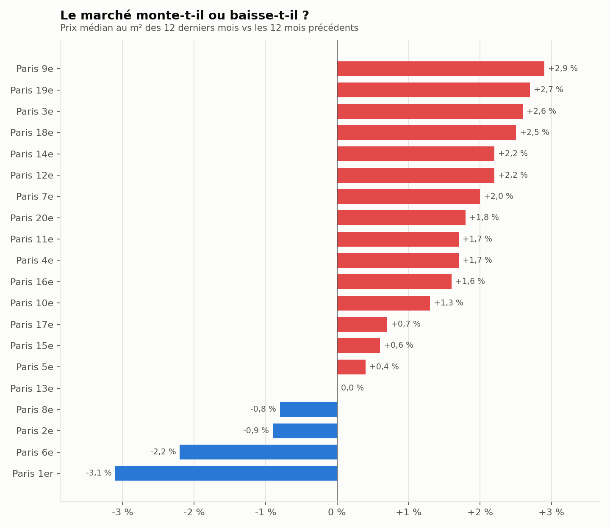

# 🏠 Immo-Hunter

**Outil d'analyse et de prédiction des prix immobiliers : ventes notariales réelles, annonces en ligne et IA.**

[**▶ Essayer l'application**](https://immo-hunter.streamlit.app) · [Le pipeline](#le-pipeline-de-bout-en-bout) · [Résultats](#résultats) · [Ce que j'ai corrigé en v3](#v2--v3--ce-que-jai-corrigé-et-pourquoi) · [Mon usage de l'IA](#comment-jai-utilisé-lia)

Pour n'importe quel appartement à Paris, l'outil répond à trois questions :

1. **Cette annonce est-elle au juste prix ?** Sous-évaluée, au prix du marché ou surévaluée, avec l'écart en %.
2. **Le marché de ce secteur monte-t-il ou baisse-t-il ?**
3. **Combien vaut ce bien ?** Une estimation, une fourchette et les ventes réelles comparables.

| **142 844** ventes notariales analysées | **12,2 %** d'erreur médiane | **77,3 %** des prix réels dans la fourchette annoncée | **8** tests automatiques |
|:---:|:---:|:---:|:---:|
| Paris, 2021–2025 | contre 14,2 % pour la méthode simple | objectif : 80 % | pytest |



---

## Pourquoi ce projet

En agence immobilière, j'ai fait des estimations de prix « à la main » : on cherche des ventes comparables dans le quartier, on ajuste selon la surface, puis on compare au prix affiché. J'ai voulu savoir si je pouvais **automatiser cette démarche avec de vraies données**, et construire un outil que n'importe qui peut réutiliser.

Le projet a commencé sur le 16e arrondissement (v1, v2). La v3 couvre tout Paris, et le pipeline fonctionne pour n'importe quelle ville de France en changeant `config.py`.

---

## Le pipeline de bout en bout



Une seule commande relance tout : `python pipeline.py --tout`

---

## Étape par étape : ce que j'ai fait et avec quels outils

### 1. Collecte des données

**Objectif :** partir de prix de vente **réels**, pas de prix d'annonce.

- **Ventes notariales DVF** (Demandes de Valeurs Foncières) : toutes les ventes immobilières enregistrées chez les notaires, en open data, déjà géolocalisées. 420 058 lignes brutes pour Paris sur 2021–2025.
- **Annonces en ligne** (module optionnel) : en v2, j'ai collecté 2 420 annonces du 16e pour les comparer aux ventes réelles.

| Outil | Ce que j'utilise | À quoi ça sert |
|---|---|---|
| `requests` | `requests.get(url)` | télécharger les fichiers DVF année par année |
| `playwright` | `sync_playwright()`, `page.goto()` | piloter un navigateur pour lire les pages d'annonces |
| `re` (regex) | `re.search()` | extraire prix, surface et pièces du texte des annonces |

### 2. Enrichissement IA des annonces

**Objectif :** une annonce, c'est surtout du texte libre (« lumineux, 4e étage avec ascenseur, DPE C, à rafraîchir… »). Ces infos ne sont pas exploitables telles quelles.

J'envoie chaque description à l'**API Claude** avec une consigne stricte : répondre en JSON, avec des valeurs imposées (`etat_general` parmi *neuf / rénové / bon / à rafraîchir…*, DPE en lettre A à G…). On obtient **plus de 50 informations structurées par annonce** (étage, ascenseur, DPE, exposition, état, cave, balcon…), directement exploitables en SQL. En v2, j'ai enrichi 579 annonces : enrichir les 2 420 aurait coûté trop cher en appels API.

Avant l'enrichissement, les **doublons** sont supprimés (même URL, ou même prix + surface + nombre de pièces). Le script **reprend là où il s'était arrêté** : une annonce déjà enrichie n'est jamais renvoyée à l'API, donc jamais payée deux fois. La **clé API** n'est jamais écrite dans le code : elle est lue dans une variable d'environnement (`ANTHROPIC_API_KEY`, voir `.env.example`).

Aujourd'hui, ces informations servent au verdict sur les annonces (cave, parking). Les ajouter au modèle de prix (étage, état, DPE) est la [prochaine étape](#limites-et-prochaines-étapes).

| Outil | Ce que j'utilise | À quoi ça sert |
|---|---|---|
| `anthropic` | `client.messages.create()` | appeler le modèle Claude avec la description et la consigne |
| `json` | `json.loads()` | transformer la réponse en données |
| `os` | `os.environ.get("ANTHROPIC_API_KEY")` | lire la clé API sans l'écrire dans le code |
| `csv` | `csv.DictReader`, `csv.DictWriter` | lire les annonces, écrire le fichier enrichi au fur et à mesure |

### 3. Nettoyage : le vrai travail

**Objectif :** une ligne = une vente d'un logement, avec un prix au m² juste.

Le piège de DVF : une vente peut contenir plusieurs lots (deux appartements, un local commercial, une cave…) et **le prix affiché sur chaque ligne est le prix total**. Diviser ce prix total par la surface d'un seul appartement donne des prix au m² faux. J'ai donc gardé uniquement les ventes d'**un seul logement**, avec éventuellement une cave ou un parking.

| Étape | Lignes / ventes restantes |
|---|---:|
| Lignes brutes DVF | 420 058 |
| Mutations distinctes (ventes, échanges, adjudications…) | 207 365 |
| … de type « Vente » | 204 462 |
| … d'un seul logement | 149 719 |
| … avec surface et position valides | 148 283 |
| … avec un prix au m² plausible (**table finale**) | 142 844 |

| Outil | Ce que j'utilise | À quoi ça sert |
|---|---|---|
| `pandas` | `read_csv()`, `concat()` | charger et empiler les fichiers annuels |
| `pandas` | `drop_duplicates()` | supprimer les lignes répétées (une vente sur plusieurs parcelles) |
| `pandas` | `crosstab()` | compter, pour chaque vente, les logements, caves et locaux |
| `pandas` | `to_numeric()`, `to_datetime()`, `between()` | typer les colonnes, filtrer les valeurs aberrantes |
| `pandas` | `to_parquet()` | sauvegarder la table propre (format compact, rapide à lire) |

### 4. Base de données et analyses SQL

**Objectif :** répondre aux questions de marché en SQL, comme on le ferait en entreprise.

J'utilise **DuckDB**, une base analytique qui lit directement le fichier de ventes, sans serveur à installer. C'est ce qui permet à l'application en ligne de fonctionner. Les requêtes sont en **SQL standard** (compatible PostgreSQL) et rangées dans [`sql/`](sql/) :

| Requête | Question | Notions SQL |
|---|---|---|
| [`evolution_prix.sql`](sql/evolution_prix.sql) | Comment évolue le prix au m² par secteur, année après année ? | `WITH` (CTE), `PERCENTILE_CONT`, fonction de fenêtre `LAG()` |
| [`tendance_12_mois.sql`](sql/tendance_12_mois.sql) | Le marché monte-t-il ou baisse-t-il sur 12 mois ? | `CASE WHEN`, `INTERVAL`, agrégats `FILTER`, `RANK()` |
| [`ventes_comparables.sql`](sql/ventes_comparables.sql) | Quelles ventes réelles ressemblent à ce bien ? | calcul de distance GPS (haversine), paramètres |
| [`centres_codes_postaux.sql`](sql/centres_codes_postaux.sql) | Où placer une annonce dont on ne connaît que le code postal ? | `ROW_NUMBER() OVER (PARTITION BY …)` |
| [`croisement_annonces_dvf.sql`](sql/croisement_annonces_dvf.sql) | Le prix affiché aujourd'hui est-il au-dessus du prix réellement vendu ? | 3 CTE, `JOIN … USING`, agrégat conditionnel `AVG(CASE WHEN …)` |

### 5. Le modèle de prix

**Objectif :** estimer le prix de vente d'un logement à partir de ce qu'on connaît pour n'importe quelle annonce : position, surface, nombre de pièces, cave ou parking, date.

Mes choix, et pourquoi :

- **Prédire le prix au m², puis multiplier par la surface.** C'est plus stable que le prix total.
- **Travailler sur le logarithme du prix au m².** Une erreur de 10 % pèse pareil sur un studio que sur un 5 pièces.
- **Comparer plusieurs algorithmes à une méthode simple.** Un modèle n'a d'intérêt que s'il fait mieux que « prix médian du secteur × surface ».
- **Validation temporelle.** J'entraîne sur le passé et je teste sur les 14 523 ventes les plus récentes (07/2025 → 12/2025), que le modèle n'a jamais vues. C'est la situation réelle : estimer un bien aujourd'hui avec l'historique.

**Résultats sur la période de test :**

| Méthode | Erreur médiane | Ventes estimées à ± 10 % | R² |
|---|---:|---:|---:|
| Méthode simple (médiane du secteur × surface) | 14,2 % | 37,6 % | 0,78 |
| Régression linéaire | 14,1 % | 36,3 % | 0,78 |
| Forêt aléatoire (Random Forest) | 12,4 % | 41,8 % | 0,85 |
| **Gradient boosting (retenu)** | **12,2 %** | 42,4 % | 0,85 |

J'ai retenu le **gradient boosting** : c'est le plus précis, et il sait aussi calculer une **fourchette** (régression quantile). Sur la période de test, la fourchette annoncée contient le vrai prix dans **77,3 %** des cas, pour un objectif de 80 %.

| Outil | Ce que j'utilise | À quoi ça sert |
|---|---|---|
| `scikit-learn` | `LinearRegression` + `OneHotEncoder`, `StandardScaler`, `ColumnTransformer`, `make_pipeline` | modèle linéaire de comparaison, avec préparation des variables |
| `scikit-learn` | `RandomForestRegressor` | forêt aléatoire : une moyenne de nombreux arbres de décision |
| `scikit-learn` | `HistGradientBoostingRegressor` (et `loss="quantile"`) | modèle retenu, et bornes basse / haute de la fourchette |
| `numpy` | `np.log()`, `np.exp()`, `np.median()` | passage au log, calcul des erreurs |
| `joblib` | `joblib.dump()` | sauvegarder le modèle entraîné pour l'application |



### 6. Croiser annonces et ventes réelles

**Objectif :** combler le retard de DVF. Les ventes notariales sont la source la plus fiable, mais elles sont publiées tard : au 24/09/2026, la dernière vente publiée date du **31/12/2025**, soit environ **9 mois** de décalage. Les annonces en ligne, elles, montrent le marché d'aujourd'hui.

Le croisement apporte deux choses :

- **pour chaque annonce**, un verdict (sous-évaluée, au prix du marché, surévaluée) en comparant le prix demandé à l'estimation du modèle ;
- **pour chaque arrondissement**, l'écart entre le prix affiché aujourd'hui et le prix réellement vendu sur les 12 derniers mois publiés. C'est un indicateur avancé du marché, qui mêle la marge de négociation et la tendance récente.

Le croisement est fait en SQL ([`croisement_annonces_dvf.sql`](sql/croisement_annonces_dvf.sql)) : une CTE par source, puis une jointure par secteur. Les annonces collectées restent en local ; seuls les résultats agrégés sont publiés.

**Déjà fait en v2 (avril 2026)** : 2 420 annonces du 16e arrondissement collectées avec Playwright, 579 enrichies par l'IA, puis croisées avec les ventes DVF dans PostgreSQL. **Le module est prêt à être relancé** : une commande collecte les annonces du jour et produit le croisement (`python pipeline.py --annonces-collecte --annonces-analyse`). Relancé régulièrement, il affine les estimations avec les prix du moment, que DVF ne montre pas encore.

### 7. Restitution : l'application web

**Objectif :** qu'un non-spécialiste puisse s'en servir.

On tape une adresse, une surface, un nombre de pièces et un prix demandé. L'application donne le verdict, l'estimation, la fourchette, le prix au m² et les 10 ventes réelles les plus proches, avec leur carte. Un deuxième onglet montre la tendance du marché par secteur.

| Outil | Ce que j'utilise | À quoi ça sert |
|---|---|---|
| `streamlit` | `st.form`, `st.metric`, `st.map`, `st.dataframe`, `st.cache_data` | interface web en Python |
| `plotly` | `go.Figure`, `add_scatter`, `go.Bar` | graphiques interactifs de l'application |
| `matplotlib` | `plt.subplots`, `savefig` | graphiques de ce README, générés par le pipeline |
| API Géoplateforme (IGN) | `requests.get()` | transformer une adresse en coordonnées GPS |

### 8. Qualité

- **Tests automatiques** (`pytest`, dossier [`tests/`](tests/)) : les règles de nettoyage (une vente de deux appartements est bien exclue…) et les seuils du verdict.
- **Configuration séparée du code** (`config.py`) : zone, années, seuils.
- **Git** : suivi des versions du projet (v1 dans le dépôt `immo-hunter`, puis v2 et v3 ici).

---

## Résultats

### Le marché parisien



À Paris, le prix médian au m² des appartements vendus est passé de **10 904 €** en 2021 à **9 643 €** en 2024 (**-11,6 %**), avant un léger rebond à **9 762 €** en 2025 (**+1,2 %**).

Sur les 12 derniers mois, **15 secteurs sur 20** sont en hausse. Plus forte hausse : Paris 9e (**+2,9 %**). Plus forte baisse : Paris 1er (**-3,1 %**).

**Contrôle de cohérence.** Pour 2025, ma table donne **9 762 €/m²** (prix médian) et **28 297 ventes** d'appartements. De leur côté, les Notaires du Grand Paris publient **9 600 €/m²** et « près de 28 000 ventes » d'appartements anciens à Paris en 2025 ([dossier de presse T4 2025](https://notairesdugrandparis.fr/sites/default/files/2026-02/Dossier%20de%20presse_T4%202025.pdf)). Les ordres de grandeur concordent, ce qui valide les règles de nettoyage.



### Ce que le modèle ne voit pas

DVF ne contient ni l'étage, ni l'état, ni le DPE, ni la vue. Deux appartements de même surface dans la même rue peuvent donc valoir ±20 % d'écart. C'est la principale limite : **avec ces seules données, une erreur médiane autour de 12,2 % est un résultat réaliste.** C'est précisément ce qu'apporte l'enrichissement IA des annonces (étage, état, DPE), et c'est la prochaine étape du projet.

---

## v2 → v3 : ce que j'ai corrigé (et pourquoi)

En relisant la v2 avec un œil critique, et en me faisant aider de l'IA pour auditer le code, j'ai trouvé des erreurs qui rendaient certains chiffres faux.

| Problème en v2 | Pourquoi c'est un problème | Correction en v3 |
|---|---|---|
| **R² = 0,92 affiché** | La variable « prix médian du micro-quartier » était calculée *avec le prix de la vente à prédire* : c'est une **fuite de données**, le modèle voyait une partie de la réponse. | Variables disponibles uniquement *avant* la vente, test sur une période future. Le R² est plus bas, mais il est honnête. |
| **Ventes multi-lots** | Prix total de plusieurs lots divisé par la surface d'un seul appartement : prix au m² surestimés. | Seules les ventes d'un seul logement sont gardées (avec un test automatique). |
| **+10 % ajoutés aux prix DVF** « pour les frais » | Les prix d'annonce n'incluent jamais les frais de notaire : la « surévaluation de +5,4 % » reposait sur une hypothèse fausse. | Plus de correction arbitraire : on compare le prix demandé à l'estimation, avec une marge de négociation explicite (5 %). |
| **Toutes les annonces placées au même point GPS** | Le modèle ne pouvait pas distinguer deux quartiers, d'où des estimations deux fois trop basses. | Chaque bien est géolocalisé (adresse, ou à défaut code postal). |
| **Dashboard Power BI** | Axes tronqués, sommes au lieu de moyennes, petits échantillons non signalés. | Une application utilisable et des graphiques générés par le code, avec l'axe à zéro. |
| **R² comme seule mesure** | Parlant pour un data scientist, pas pour un métier. | Erreur médiane en %, part des ventes estimées à ± 10 %, fiabilité de la fourchette. |

---

## Comment j'ai utilisé l'IA

Je l'assume : **ce projet a été construit avec l'IA**, de deux façons.

1. **Comme assistant de développement (Claude).** Écrire et restructurer le code Python et SQL, auditer la v2, m'expliquer les notions que je ne maîtrisais pas encore.
2. **Comme brique du pipeline (API Claude).** Transformer le texte libre des annonces en données structurées.

**Ce qui vient de moi :**

- la question métier, issue de mon expérience en agence immobilière ;
- le choix des sources et des règles métier : ce qu'est un bien comparable, la marge de négociation, l'exclusion des ventes multi-lots ;
- la vérification des résultats et la remise en question de la v2 ;
- les décisions : tout Paris plutôt que le 16e seul, abandon de Power BI, modèle le plus simple quand un ajout n'apporte rien.

Je ne prétends pas avoir écrit chaque ligne à la main. En revanche, je sais expliquer chaque étape, chaque choix et chaque chiffre de ce README.

---

## Limites et prochaines étapes

- **Intégrer l'enrichissement IA au modèle** pour les annonces : étage, état et DPE sont les critères qui manquent le plus.
- **Délai de DVF** : environ 9 mois de retard sur les ventes réelles. C'est la raison du croisement avec les annonces en ligne, à relancer régulièrement.
- **Autres villes** : le pipeline est prêt (`config.py`), à valider hors Paris, maisons incluses.
- **Annonces** : module d'usage personnel, dans le respect des conditions d'utilisation des sites. Les annonces collectées ne sont pas publiées dans ce dépôt.

---

## Lancer le projet

```bash
git clone https://github.com/maxime-txn/immo-hunter-2.git
cd immo-hunter-2
python3 -m venv venv && source venv/bin/activate
pip install -r requirements.txt

python pipeline.py --tout      # télécharge DVF, nettoie, entraîne, génère les graphiques
streamlit run app.py           # lance l'application en local
pytest                         # lance les tests

# Module optionnel « annonces »
pip install -r requirements-annonces.txt && playwright install chromium
export ANTHROPIC_API_KEY=...   # pour l'enrichissement IA
python pipeline.py --annonces-collecte --annonces-enrichissement
python pipeline.py --annonces-analyse    # verdicts + croisement avec les ventes DVF
```

## Structure

```
immo-hunter-2/
├── pipeline.py              # point d'entrée : lance chaque étape
├── config.py                # zone, années, seuils (seul fichier à modifier pour une autre ville)
├── app.py                   # application web (Streamlit)
├── immohunter/
│   ├── collecte_dvf.py      # 1. téléchargement des ventes DVF
│   ├── nettoyage.py         # 3. règles de nettoyage
│   ├── base.py              # 4. connexion DuckDB, exécution des requêtes SQL
│   ├── modele.py            # 5. comparaison des modèles, entraînement, estimation
│   ├── verdict.py           #    sous-évalué / au prix / surévalué
│   ├── geocodage.py         #    adresse -> GPS
│   ├── rapports.py          #    graphiques du README
│   └── annonces/            # module optionnel : collecte, enrichissement IA, analyse en lot
├── sql/                     # requêtes d'analyse (SQL standard)
├── data/ventes.parquet      # table propre des ventes
├── modeles/                 # modèle entraîné + évaluation
├── rapports/                # graphiques
└── tests/                   # tests automatiques
```

---

**Maxime Teixeira** · M2 Data Science & Business Intelligence, EDC Paris Business School · en recherche d'alternance Data Analyst
[LinkedIn](https://www.linkedin.com/in/mtxn) · Données : DVF, Licence Ouverte Etalab · Les estimations ne constituent pas un conseil en investissement.
