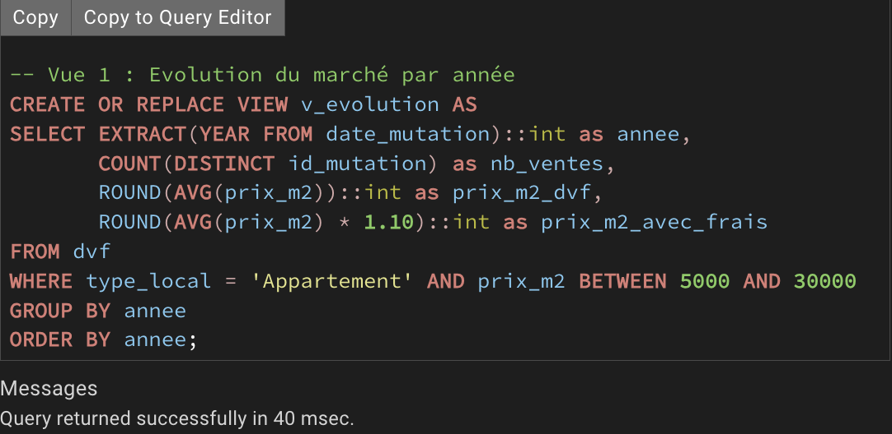
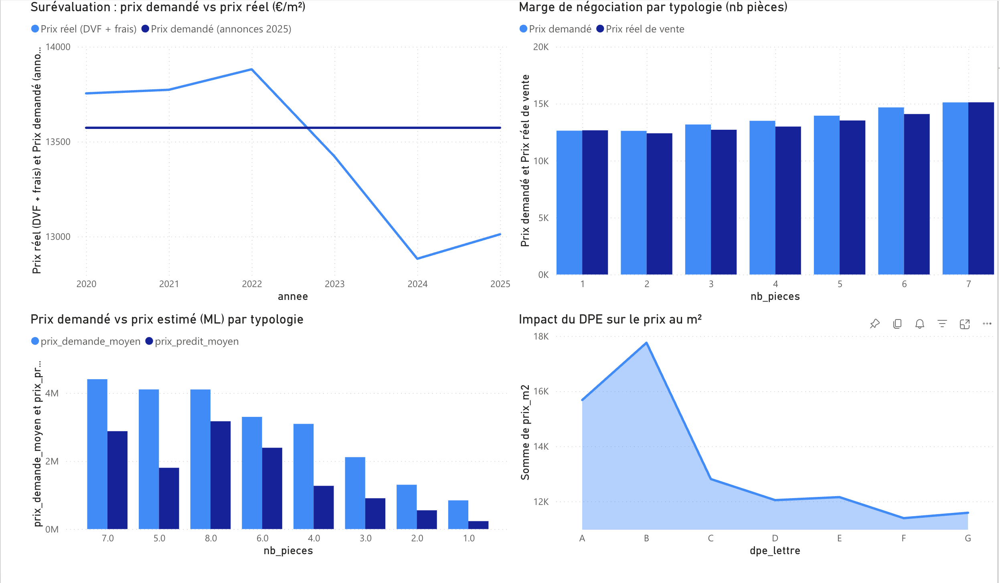
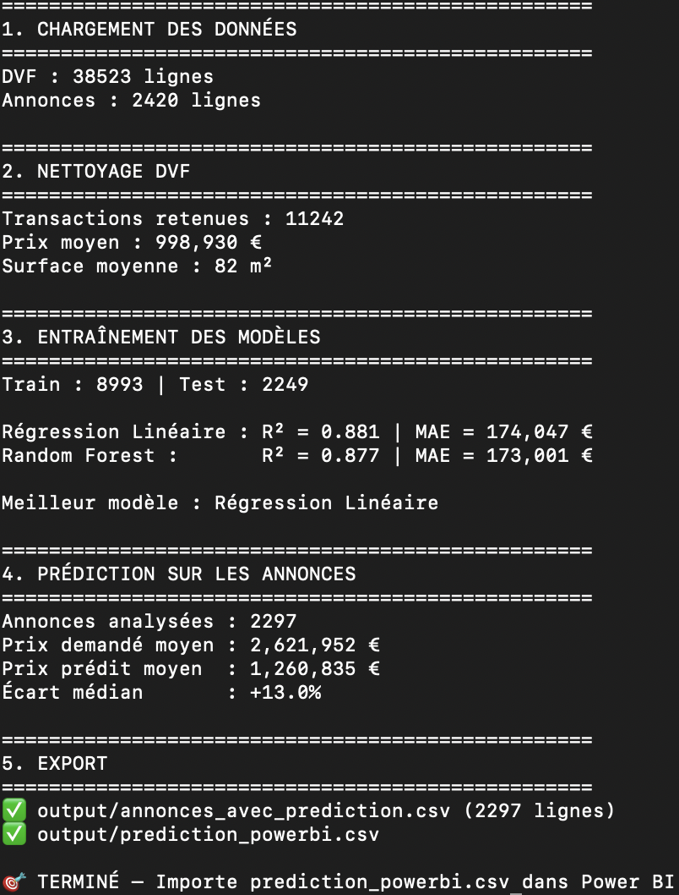

# 🏠 Immo-Hunter — Analyse du marché immobilier Paris 16e

> **2 420 annonces scrapées** + **38 523 transactions DVF** · Analyse SQL + Dashboard Power BI · Surévaluation moyenne : **+5.4%** · Modèle ML (**R² = 0.88**)

---

## 💡 Innovation du projet

Utilisation d'un LLM (Claude, Anthropic) pour transformer des descriptions immobilières non structurées en données exploitables — **50 features extraites automatiquement** (étage, DPE, exposition, état général, quartier, points forts/faibles…) à partir de texte libre.

---

## Pourquoi ce projet ?

Je suis étudiant en M1 Data Science & BI à EDC Paris et je cherche une alternance en Data Analyst / BI Analyst pour mon M2 (septembre 2026). J'ai voulu construire un projet de bout en bout, de la collecte de données jusqu'à la visualisation, sur un sujet concret : **le marché immobilier dans le 16e arrondissement de Paris**.

L'objectif était simple : récupérer des données réelles, les analyser, et répondre à une question : **est-ce que les vendeurs surévaluent leurs biens par rapport aux prix réels du marché ?**

> **Note** : J'ai fait l'analyse sur le 16e arrondissement, mais le scraper et le pipeline sont configurables pour n'importe quelle ville ou région en France. Il suffit de changer la ville et le code postal dans `config.py` pour relancer l'analyse ailleurs.

---

## Ce que j'ai fait

### 1. Collecte des données

J'ai récupéré deux sources de données :

- **2 420 annonces** scrappées depuis un leader de l'immobilier en ligne avec **Playwright** (navigateur headless). Le site utilise des protections anti-bot (CAPTCHA, détection de webdriver, bannières de cookies). J'ai dû configurer un user-agent réaliste, désactiver les marqueurs d'automatisation, et gérer les pauses aléatoires entre les requêtes pour simuler un comportement humain. Le scraper récupère les fiches résumées puis visite chaque annonce individuellement pour extraire la description complète — **1 538 descriptions récupérées (64%)**. Le dataset final contient principalement des appartements (2 237), mais aussi des duplex, maisons, studios, lofts et villas.
- **38 523 transactions réelles** (DVF — Données de Valeurs Foncières) téléchargées automatiquement depuis data.gouv.fr via un script Python (`requests`), couvrant la période 2020-2025.

### 2. Enrichissement IA

J'ai utilisé l'**API Claude** (Anthropic, via la bibliothèque `anthropic`) pour analyser les descriptions en texte libre des annonces et en extraire des données structurées en JSON : étage, DPE, exposition, état général, ascenseur, cave, balcon, proximité transports, points forts/faibles, etc. — soit **50 colonnes** dans le CSV enrichi.

J'ai enrichi **579 annonces sur les 2 420** — enrichir l'intégralité de la base aurait représenté un coût API trop élevé. J'ai donc travaillé sur un échantillon, ce qui m'a quand même permis d'extraire 350 étages, 279 états généraux, 115 DPE et d'identifier 290 quartiers différents (Passy, Auteuil, Trocadéro, Victor Hugo, La Muette...). Le reste de l'enrichissement (mots-clés, regex) a été fait en SQL.

### 3. Base de données et nettoyage

J'ai importé les deux datasets dans **PostgreSQL** et j'ai fait le nettoyage et l'enrichissement complémentaire directement en SQL dans pgAdmin :

- Extraction du DPE, de l'étage et de l'exposition par regex
- Détection de mots-clés dans les descriptions (ascenseur, balcon, terrasse, lumineux, calme, rénové…)
- Calcul du prix/m² sur les deux tables
- Création de vues pour chaque axe d'analyse

### 4. Analyse SQL

J'ai construit plusieurs analyses à partir des vues SQL :

- Évolution des prix/m² de 2020 à 2025
- Comparaison prix annonces vs prix de vente réels
- Impact du DPE sur le prix
- Marge de négociation par type de bien



### 5. Visualisation Power BI

J'ai exporté les résultats en CSV et construit un **dashboard Power BI** avec 4 graphiques :

- **Surévaluation : prix demandé vs prix réel (€/m²)** — courbe DVF + frais (2020-2025) comparée au prix moyen des annonces. On voit le marché passer au-dessus puis en dessous du prix demandé à partir de 2023.
- **Marge de négociation par typologie (nb pièces)** — barres groupées montrant l'écart entre prix demandé et prix réel de vente, de 1 à 7 pièces.
- **Prix demandé vs prix estimé (ML) par typologie** — les prédictions du modèle confrontées aux prix affichés, par nombre de pièces.
- **Impact du DPE sur le prix au m²** — évolution du prix selon la lettre DPE (A → G), montrant l'écart de valorisation entre biens performants et passoires énergétiques.



### 6. Prédiction de prix (Machine Learning)

J'ai fait un modèle simple en Python avec scikit-learn pour prédire le prix des biens à partir de 3 variables : surface, nombre de pièces et année de transaction.

J'ai comparé deux modèles :

| Modèle | R² | MAE |
|---|---|---|
| **Régression Linéaire** | **0.881** | 174 047 € |
| Random Forest | 0.877 | 173 001 € |

Le modèle est ensuite appliqué sur les annonces en ligne pour estimer si le prix demandé est cohérent avec le marché.



### Limites du modèle

Le modèle est volontairement simple (3 features, régression linéaire). Le R² de 0.88 est élevé car la surface explique l'essentiel du prix total, mais le modèle ne capte pas les critères qualitatifs qui font la vraie différence : l'étage, la vue, le DPE, l'état du bien, la rue exacte. Pour améliorer la précision, il faudrait intégrer les features extraites par l'enrichissement IA (DPE, étage, exposition, état général) — c'est une piste d'amélioration pour une prochaine version.

---

## Ce qu'on retient

### Le marché du 16e : montée, chute, et début de reprise

Les prix/m² ont progressé entre 2020 et 2022, atteignant un pic à 12 619 €/m² net vendeur. À partir de 2023, le marché s'est retourné : baisse des prix (-7% entre 2022 et 2024, tombant à 11 712 €/m²) accompagnée d'une baisse du volume de ventes (de 2 921 transactions en 2022 à 2 043 en 2024). En 2025, on observe un léger rebond à 11 829 €/m² — le marché du 16e semble doucement se redresser.

### Les vendeurs surévaluent, mais pas toujours

En comparant les prix affichés dans les annonces (13 573 €/m²) aux prix de vente réels (DVF), on constate que les vendeurs surévaluent leurs biens en moyenne de **+5.4% en 2024**. Mais ce n'était pas le cas avant : en 2020-2022, les prix réels étaient supérieurs aux annonces actuelles — la surévaluation est un phénomène récent, lié à la baisse du marché.

**Point méthodo** : les données DVF sont en prix net vendeur (hors frais). Les annonces incluent les frais de notaire et d'agence. Pour rendre la comparaison fiable, j'ai ajouté ~10% aux prix DVF.

### Le DPE impacte fortement le prix

Les biens bien classés énergétiquement se vendent nettement plus cher. Un bien classé B atteint 17 758 €/m² contre 11 391 €/m² pour un F — soit un écart de +56%. Même entre C (12 810 €/m²) et D (12 045 €/m²), il y a 6% de différence. Dans un contexte de durcissement des réglementations énergétiques, le DPE devient un critère déterminant dans la valorisation d'un bien.

### La marge de négociation dépend de la taille du bien

Sur les studios, la marge est quasi nulle (-0.2%) : le marché est tendu, peu de place pour négocier. Sur les 3-4 pièces, on peut négocier environ 3.5%. Sur les 6 pièces, jusqu'à 4%. Les très grands appartements (7 pièces) reviennent à 0% — probablement parce que ce sont des biens de prestige avec des acheteurs prêts à payer le prix affiché.

---

## Outils utilisés

### Python

| Bibliothèque | Usage |
|---|---|
| `playwright` | Scraping headless — navigation, contournement anti-bot, extraction des descriptions |
| `beautifulsoup4` | Parsing HTML complémentaire |
| `requests` | Téléchargement automatique des fichiers DVF depuis data.gouv.fr |
| `anthropic` | Appels API Claude pour l'enrichissement IA des descriptions |
| `pandas` | Manipulation et nettoyage des données pour le modèle ML |
| `scikit-learn` | Modèles ML — `LinearRegression`, `RandomForestRegressor`, `train_test_split` |
| `openpyxl` | Export Excel formaté (en-têtes colorés, hyperliens, filtres auto) |
| `psycopg2` | Connexion Python → PostgreSQL pour l'import des CSV |
| `csv`, `json`, `re` | Parsing CSV, parsing JSON (réponses IA), extraction regex |

### Base de données et BI

| Outil | Usage |
|---|---|
| **PostgreSQL 18** | Stockage des deux datasets (annonces + DVF) |
| **pgAdmin 4** | Requêtes SQL, enrichissement regex, création de vues d'analyse |
| **Power BI** | Dashboard interactif avec 4 visualisations |

### Données

| Source | Contenu |
|---|---|
| **Site leader immobilier** | 2 420 annonces avec descriptions (scraping Playwright) |
| **DVF** (data.gouv.fr) | 38 523 transactions réelles 2020-2025 |

---

## Architecture du projet

```
immo-hunter/
├── README.md
├── main.py               # Scraping → CSV
├── predict.py             # Modèle ML → export Power BI
├── import_db.py           # Import CSV → PostgreSQL
├── config.py
├── requirements.txt
├── scraper/               # Scraper Playwright
├── enrichment/            # Enrichissement Claude API
├── dvf/                   # Téléchargement DVF
├── screenshots/           # Screenshots pour le README
└── output/                # Données (exclu du repo)
```

---

## Installation

```bash
git clone https://github.com/ton-username/immo-hunter.git
cd immo-hunter
python3 -m venv venv
source venv/bin/activate
pip install -r requirements.txt
```

---

## ⚠️ Disclaimer

Ce projet est réalisé dans un cadre pédagogique et portfolio. Les données DVF sont publiques (data.gouv.fr). Les prédictions du modèle ML ne constituent pas des conseils en investissement immobilier.

---

## Auteur

**Maxime Teixeira Novais**
M1 Data Science & BI — EDC Paris Business School
